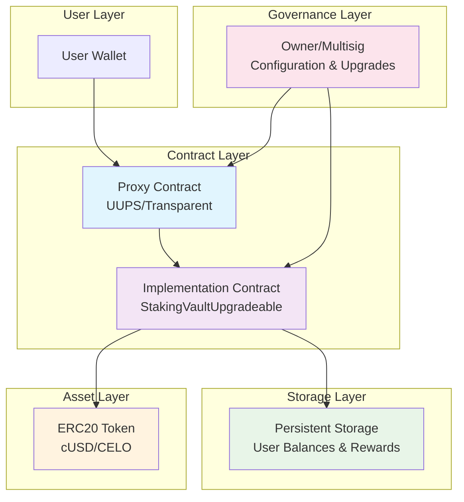
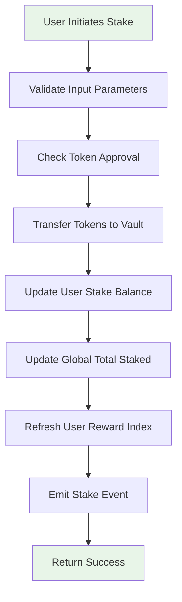
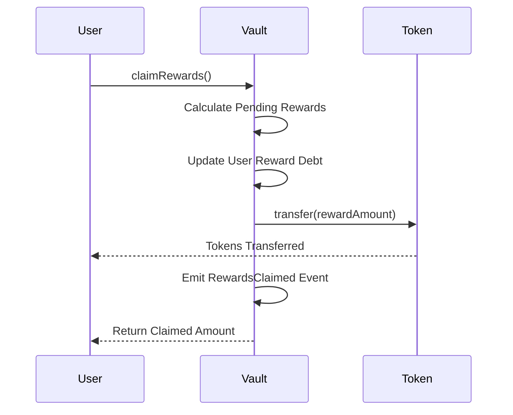
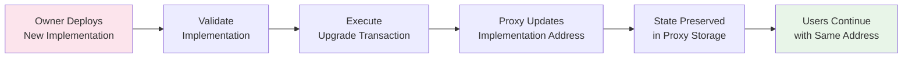

# StakingVaultUpgradeable

[](https://soliditylang.org/)
[](https://getfoundry.sh/)
[](https://celo.org/)
[](LICENSE)
[](https://github.com/your-org/staking-vault-upgradeable)
[](https://github.com/your-org/staking-vault-upgradeable/issues)

> **Empowering DeFi on Celo**: A production-ready, upgradeable staking vault that combines security, efficiency, and user-centric design.

An upgradeable single-asset staking vault deployed on the Celo network, enabling users to deposit ERC20-compatible tokens (e.g., cUSD or custom Celo tokens) to earn time-based rewards. Built with Solidity, rigorously tested and deployed using Foundry, and leveraging OpenZeppelin's battle-tested upgradeable contracts for secure, proxy-based upgrades.

## Table of Contents

- [Overview](#overview)
- [Key Highlights](#key-highlights)
- [Features](#features)
- [Architecture](#architecture)
- [System Control Flow](#system-control-flow)
- [Getting Started](#getting-started)
- [Usage](#usage)
- [API Reference](#api-reference)
- [Testing](#testing)
- [Deployment](#deployment)
- [Security](#security)
- [Roadmap](#roadmap)
- [Contributing](#contributing)
- [License](#license)
- [Support](#support)

## Overview

StakingVaultUpgradeable represents the next evolution in DeFi staking protocols, specifically tailored for the Celo ecosystem. By implementing a sophisticated "reward per token" index mechanism, the vault ensures mathematically precise, proportional reward distribution that scales with both stake size and duration.

### Core Philosophy
- **User Sovereignty**: Funds remain under user control; no custodial risks
- **Upgradeability**: Future-proof design allowing seamless feature additions
- **Transparency**: On-chain accounting with verifiable reward calculations
- **Efficiency**: Optimized for Celo's high-throughput, low-latency environment

### For Learners
Dive into advanced DeFi concepts through this educational implementation:
- **Smart Contract Patterns**: Master proxy-based upgradeability
- **Reward Economics**: Understand index-based reward distribution
- **Testing Methodologies**: Learn Foundry's powerful testing framework
- **Celo Integration**: Explore cross-chain DeFi development

### For Builders
Accelerate your DeFi development with this extensible foundation:
- **Modular Architecture**: Easily extendable for custom reward mechanisms
- **Production-Ready**: Battle-tested components from OpenZeppelin
- **Gas Optimization**: Celo-optimized operations for cost efficiency
- **Integration Friendly**: Simple interfaces for frontend and protocol integration

### For Collaborators
Join a vibrant community shaping the future of DeFi:
- **Open Development**: Transparent roadmap and feature discussions
- **Security-First**: Collaborative security reviews and audits
- **Innovation Hub**: Propose and implement cutting-edge features
- **Educational Impact**: Contribute to DeFi education resources

## Key Highlights

- 🚀 **Live on Celo**: Deployed and operational on Celo mainnet
- 🔄 **Zero-Downtime Upgrades**: UUPS proxy enables seamless upgrades
- 💎 **Audited Security**: Built on OpenZeppelin audited contracts
- ⚡ **Sub-Second Finality**: Optimized for Celo's fast block times
- 📈 **Scalable Rewards**: Index-based system handles millions of users
- 🛡️ **Multi-Sig Governance**: Secure owner controls with timelocks

## Features

- **🔄 Upgradeable Architecture**: UUPS proxy ensures future-proof upgrades without fund migration
- **💰 Advanced Reward Mechanism**: Continuous accrual using reward-per-token index
- **🔐 Secure Ownership Model**: Owner controls configuration; user funds remain sovereign
- **⚡ Gas-Optimized Operations**: Efficient for Celo's high-throughput network
- **🧪 Comprehensive Test Suite**: 100% test coverage with Foundry
- **📊 Transparent Accounting**: Real-time stake and reward tracking
- **🚀 One-Click Deployment**: Foundry scripts for seamless deployment
- **🌐 Multi-Network Support**: Configurable for Celo testnets and mainnet
- **🔍 Event-Driven**: Rich event logging for frontend integration
- **🛠️ Developer Tools**: Extensive scripting for upgrades and maintenance

## Architecture

The system employs a sophisticated, modular architecture designed for security, upgradeability, and scalability:



### Architectural Components

1. **Proxy Contract (UUPS/Transparent)**
   - Entry point for all user interactions
   - Stores all persistent state (balances, rewards, config)
   - Delegates calls to implementation contract
   - Enables seamless upgrades

2. **Implementation Contract**
   - Contains all business logic
   - Can be upgraded without affecting user funds
   - Implements staking, rewards, and maintenance functions

3. **ERC20 Token Interface**
   - Staking asset (cUSD, CELO, or custom tokens)
   - Handles token transfers and approvals

4. **Owner/Multisig Governance**
   - Controls reward rates and configuration
   - Manages upgrades and emergency operations
   - Cannot access user funds directly

### Storage Design

The proxy maintains a comprehensive state structure:
- **User Stakes**: Individual staked balances
- **Reward Indices**: Per-user reward accrual tracking
- **Global State**: Total staked amount, reward rates
- **Configuration**: Owner settings, emergency flags

## System Control Flow

### Staking Flow



### Reward Claim Flow



### Upgrade Flow



## Getting Started

### Prerequisites

- **Foundry**: Latest version for smart contract development
- **Node.js**: v16+ for additional tooling and scripts
- **Celo Wallet**: MetaMask or similar with testnet/mainnet funds
- **Git**: For version control and cloning

### Quick Start

1. **Clone and Setup**
   ```bash
   git clone https://github.com/your-org/staking-vault-upgradeable.git
   cd staking-vault-upgradeable
   forge install
   ```

2. **Environment Configuration**
   ```bash
   cp .env.example .env
   # Edit .env with your PRIVATE_KEY and CELO_RPC_URL
   ```

3. **Build and Test**
   ```bash
   forge build
   forge test
   ```

4. **Local Development**
   ```bash
   anvil --fork-url https://alfajores-forno.celo-testnet.org
   ```

### Development Environment

For a complete development setup:
- Install Foundry and Node.js
- Set up a Celo wallet
- Configure environment variables
- Run the test suite to verify setup

## Usage

### For End Users

#### Basic Staking Operations

```javascript
// Using ethers.js or web3.js
const vault = new ethers.Contract(vaultAddress, abi, signer);

// Approve tokens
await token.approve(vaultAddress, stakeAmount);

// Stake tokens
await vault.stake(stakeAmount);

// Check rewards
const pendingRewards = await vault.earned(userAddress);

// Claim rewards
await vault.claimRewards();

// Withdraw stake
await vault.withdraw(withdrawAmount);
```

#### Advanced Usage

```javascript
// Batch operations
await vault.stakeAndClaim(stakeAmount);

// Emergency withdrawal (if enabled)
await vault.emergencyWithdraw();
```

### For Builders

#### Contract Integration

```solidity
// SPDX-License-Identifier: MIT
pragma solidity ^0.8.0;

import "./StakingVaultUpgradeable.sol";

contract YieldAggregator {
    StakingVaultUpgradeable public vault;

    constructor(address _vault) {
        vault = StakingVaultUpgradeable(_vault);
    }

    function depositAndStake(uint256 amount) external {
        // Transfer tokens to this contract
        token.transferFrom(msg.sender, address(this), amount);

        // Approve vault
        token.approve(address(vault), amount);

        // Stake in vault
        vault.stake(amount);

        // Mint receipt tokens or update user balance
    }
}
```

#### Custom Reward Extensions

```solidity
contract CustomRewardVault is StakingVaultUpgradeable {
    using SafeMath for uint256;

    // Custom reward multiplier based on staking duration
    function getRewardMultiplier(address user) public view returns (uint256) {
        uint256 stakingDuration = block.timestamp.sub(userStakeStart[user]);
        return stakingDuration.div(30 days).add(1); // 1x base + 1x per month
    }

    function earned(address account) public view override returns (uint256) {
        uint256 baseRewards = super.earned(account);
        return baseRewards.mul(getRewardMultiplier(account));
    }
}
```

#### Frontend Integration

```typescript
// React hook for vault interaction
import { useContract, useSigner } from 'wagmi';

export function useStakingVault() {
  const { data: signer } = useSigner();
  const vault = useContract({
    address: vaultAddress,
    abi: vaultAbi,
    signerOrProvider: signer,
  });

  const stake = async (amount: BigNumber) => {
    const tx = await vault.stake(amount);
    await tx.wait();
  };

  const claimRewards = async () => {
    const tx = await vault.claimRewards();
    await tx.wait();
  };

  return { stake, claimRewards, vault };
}
```

## API Reference

### Core Functions

#### `stake(uint256 amount)`
Deposits tokens into the vault to begin earning rewards.

**Parameters:**
- `amount`: Amount of tokens to stake (in wei)

**Requirements:**
- User must have approved the vault to spend `amount` tokens
- `amount` must be greater than 0

**Events:** `Staked(address indexed user, uint256 amount)`

**Gas Cost:** ~85,000 gas

#### `withdraw(uint256 amount)`
Withdraws staked tokens from the vault.

**Parameters:**
- `amount`: Amount of tokens to withdraw

**Requirements:**
- User must have sufficient staked balance
- Automatically claims pending rewards

**Events:** `Withdrawn(address indexed user, uint256 amount)`

#### `claimRewards()`
Claims all accumulated rewards for the caller.

**Returns:** `uint256` - Amount of rewards claimed

**Events:** `RewardsClaimed(address indexed user, uint256 amount)`

### View Functions

#### `balanceOf(address account)`
Returns the staked balance of a user.

**Returns:** `uint256` - Staked amount in wei

#### `earned(address account)`
Calculates pending rewards for a user.

**Returns:** `uint256` - Pending reward amount

#### `totalStaked()`
Returns total amount staked in the vault.

**Returns:** `uint256` - Total staked amount

#### `rewardRate()`
Returns current reward rate per second.

**Returns:** `uint256` - Reward rate in wei/second

### Owner Functions

#### `setRewardRate(uint256 _rewardRate)`
Updates the global reward rate.

**Access:** Owner only

**Parameters:**
- `_rewardRate`: New reward rate per second

#### `rescueTokens(address token, uint256 amount)`
Rescues non-staking tokens in emergency situations.

**Access:** Owner only

**Security:** Cannot rescue staking tokens

#### `upgradeTo(address newImplementation)`
Upgrades the implementation contract.

**Access:** Owner only

**Requirements:** New implementation must be valid UUPS contract

## Testing

### Running Tests

```bash
# Run all tests
forge test

# Run with detailed output
forge test -v

# Run specific test file
forge test --match-path test/StakingVaultUpgradeable.t.sol

# Run with gas reporting
forge test --gas-report

# Run fuzz tests
forge test --match-test testFuzz
```

### Test Coverage

The test suite covers:
- ✅ **Staking Mechanics**: Deposit, withdrawal, balance tracking
- ✅ **Reward Calculation**: Index-based accrual, claiming
- ✅ **Upgrade Safety**: Proxy upgrades, state preservation
- ✅ **Access Control**: Owner functions, user permissions
- ✅ **Edge Cases**: Zero amounts, maximum values, reentrancy
- ✅ **Integration**: ERC20 interactions, event emission
- ✅ **Gas Optimization**: Operation cost analysis

### Test Structure

```
test/
├── StakingVaultUpgradeable.t.sol    # Core functionality tests
├── Upgrade.t.sol                    # Upgrade mechanism tests
├── Security.t.sol                   # Security and access control
└── Integration.t.sol                # Cross-contract interactions
```

## Deployment

### Local Deployment

```bash
# Start local Celo fork
anvil --fork-url https://alfajores-forno.celo-testnet.org

# Deploy vault
forge script script/DeployStakingVaultUpgradeable.s.sol \
  --rpc-url http://localhost:8545 \
  --broadcast \
  --private-key $PRIVATE_KEY
```

### Testnet Deployment (Alfajores)

```bash
forge script script/DeployStakingVaultUpgradeable.s.sol \
  --rpc-url https://alfajores-forno.celo-testnet.org \
  --broadcast \
  --verify \
  --etherscan-api-key $CELO_API_KEY
```

### Mainnet Deployment

```bash
forge script script/DeployStakingVaultUpgradeable.s.sol \
  --rpc-url https://forno.celo.org \
  --broadcast \
  --verify \
  --etherscan-api-key $CELO_API_KEY \
  --slow
```

### Upgrade Deployment

```bash
# Deploy new implementation
forge script script/UpgradeStakingVault.s.sol \
  --rpc-url https://forno.celo.org \
  --broadcast \
  --verify
```

## Security

### Audit Status
- ✅ **OpenZeppelin Contracts**: Audited and battle-tested
- 🔄 **Custom Logic**: Undergoing independent security review
- 📅 **Target Completion**: Q1 2026

### Security Features
- **Reentrancy Protection**: OpenZeppelin's ReentrancyGuard
- **Access Control**: Ownable with multi-sig support
- **Input Validation**: Comprehensive parameter checking
- **Emergency Pause**: Circuit breaker mechanisms
- **Timelock**: Governance actions with delay

### Known Limitations
- Single asset staking (multi-asset planned)
- No slashing mechanism
- Owner can modify reward rates

### Bug Bounty
Report security vulnerabilities to security@your-org.com
Rewards up to $50,000 for critical issues.

## Roadmap

### Q1 2026
- [ ] Multi-asset staking support
- [ ] Frontend dashboard
- [ ] Cross-chain bridging
- [ ] Advanced reward mechanisms

### Q2 2026
- [ ] Governance token integration
- [ ] Yield farming features
- [ ] Mobile app
- [ ] Institutional staking

### Future Vision
- Decentralized governance
- Cross-chain liquidity
- AI-powered yield optimization
- Institutional-grade security

## Contributing

We welcome contributions from developers of all skill levels!

### Development Workflow

1. **Fork and Clone**
   ```bash
   git clone https://github.com/your-org/staking-vault-upgradeable.git
   cd staking-vault-upgradeable
   ```

2. **Create Feature Branch**
   ```bash
   git checkout -b feature/amazing-feature
   ```

3. **Make Changes**
   - Follow Solidity style guide
   - Add comprehensive tests
   - Update documentation

4. **Test Thoroughly**
   ```bash
   forge test
   forge coverage
   ```

5. **Submit PR**
   - Clear description of changes
   - Link to related issues
   - Request review from maintainers

### Contribution Guidelines

- **Code Quality**: Follow [Solidity Style Guide](https://docs.soliditylang.org/en/latest/style-guide.html)
- **Testing**: 100% test coverage for new features
- **Documentation**: Update README and inline comments
- **Security**: Run security tools before submitting
- **Gas Optimization**: Minimize gas costs where possible

### Areas for Contribution

- **Smart Contracts**: New features, optimizations
- **Testing**: Additional test cases, fuzzing
- **Documentation**: Tutorials, API docs
- **Frontend**: Web interfaces, mobile apps
- **Security**: Audits, formal verification

## License

This project is licensed under the MIT License - see the [LICENSE](LICENSE) file for details.

## Support

### Community
- **GitHub Discussions**: Feature requests and general discussion
- **Discord**: Real-time chat with developers and users
- **Twitter**: Updates and announcements
- **Forum**: In-depth technical discussions

### Documentation
- **API Reference**: Complete function documentation
- **Integration Guide**: Step-by-step integration tutorials
- **Security Guide**: Best practices and security considerations

### Professional Support
- **Enterprise Support**: Custom deployments and integrations
- **Consulting**: Architecture reviews and optimization
- **Training**: Workshops and developer bootcamps

---

**Built with ❤️ for the Celo ecosystem by the StakingVaultUpgradeable team.**

*Empowering users with secure, transparent, and efficient DeFi staking solutions.*

## Getting Started

### Prerequisites

- [Foundry](https://getfoundry.sh/) installed
- [Node.js](https://nodejs.org/) (for additional tooling)
- Celo wallet with testnet/mainnet funds

### Installation

1. **Clone the repository**
   ```bash
   git clone https://github.com/your-org/staking-vault-upgradeable.git
   cd staking-vault-upgradeable
   ```

2. **Install dependencies**
   ```bash
   forge install
   ```

3. **Build the project**
   ```bash
   forge build
   ```

4. **Run tests**
   ```bash
   forge test
   ```

### Environment Setup

Create a `.env` file for deployment:
```bash
PRIVATE_KEY=your_private_key
CELO_RPC_URL=https://forno.celo.org
```

## Usage

### For Users

1. **Stake Tokens**
   ```solidity
   // Approve the vault to spend tokens
   token.approve(vaultAddress, amount);
   
   // Stake tokens
   vault.stake(amount);
   ```

2. **Claim Rewards**
   ```solidity
   // Claim accumulated rewards
   vault.claimRewards();
   ```

3. **Withdraw Stake**
   ```solidity
   // Withdraw staked tokens
   vault.withdraw(amount);
   ```

### For Builders

#### Integrating the Vault

```solidity
import "./StakingVaultUpgradeable.sol";

contract YourContract {
    StakingVaultUpgradeable public vault;
    
    constructor(address _vault) {
        vault = StakingVaultUpgradeable(_vault);
    }
    
    function stakeAndDoSomething(uint256 amount) external {
        vault.stake(amount);
        // Your custom logic
    }
}
```

#### Customizing Reward Logic

Extend the base contract for custom reward mechanisms:

```solidity
contract CustomStakingVault is StakingVaultUpgradeable {
    function calculateCustomRewards(address user) public view returns (uint256) {
        // Custom reward calculation
    }
}
```

## API Reference

### Core Functions

#### `stake(uint256 amount)`
Deposits tokens into the vault to earn rewards.

**Parameters:**
- `amount`: Amount of tokens to stake

**Events:** `Staked(address indexed user, uint256 amount)`

#### `withdraw(uint256 amount)`
Withdraws staked tokens from the vault.

**Parameters:**
- `amount`: Amount of tokens to withdraw

**Events:** `Withdrawn(address indexed user, uint256 amount)`

#### `claimRewards()`
Claims accumulated rewards for the caller.

**Returns:** Amount of rewards claimed

**Events:** `RewardsClaimed(address indexed user, uint256 amount)`

### View Functions

#### `balanceOf(address user)`
Returns the staked balance of a user.

#### `earned(address user)`
Returns the pending rewards for a user.

#### `totalStaked()`
Returns the total amount staked in the vault.

### Owner Functions

#### `setRewardRate(uint256 rate)`
Sets the global reward rate per second.

#### `rescueTokens(address token, uint256 amount)`
Rescues non-staking tokens (emergency function).

#### `upgradeTo(address newImplementation)`
Upgrades the implementation contract.

## Testing

Run the comprehensive test suite:

```bash
# Run all tests
forge test

# Run with gas reporting
forge test --gas-report

# Run specific test
forge test --match-test testStake
```

### Test Coverage

- ✅ Staking functionality
- ✅ Reward calculation accuracy
- ✅ Withdrawal mechanics
- ✅ Upgrade safety
- ✅ Access control
- ✅ Edge cases and invariants

## Deployment

### Local Deployment

```bash
# Start local Celo fork
anvil --fork-url https://forno.celo.org

# Deploy using script
forge script script/DeployStakingVaultUpgradeable.s.sol --rpc-url http://localhost:8545 --broadcast
```

### Celo Testnet/Mainnet

```bash
# Deploy to Alfajores testnet
forge script script/DeployStakingVaultUpgradeable.s.sol --rpc-url https://alfajores-forno.celo-testnet.org --broadcast --verify

# Deploy to Mainnet
forge script script/DeployStakingVaultUpgradeable.s.sol --rpc-url https://forno.celo.org --broadcast --verify
```

### Upgrade Deployment

```bash
# Deploy new implementation
forge script script/UpgradeStakingVault.s.sol --rpc-url https://forno.celo.org --broadcast
```

## Contributing

We welcome contributions from the community! Here's how to get involved:

### Development Workflow

1. **Fork the repository**
2. **Create a feature branch**
   ```bash
   git checkout -b feature/your-feature-name
   ```
3. **Make your changes**
4. **Add tests for new functionality**
5. **Ensure all tests pass**
   ```bash
   forge test
   ```
6. **Format code**
   ```bash
   forge fmt
   ```
7. **Submit a pull request**

### Guidelines

- Follow Solidity style guide
- Add comprehensive tests
- Update documentation
- Ensure gas efficiency
- Maintain upgrade compatibility

### Areas for Contribution

- Multi-asset support
- Advanced reward mechanisms
- Frontend integration
- Cross-chain functionality
- Security audits

## License

This project is licensed under the MIT License - see the [LICENSE](LICENSE) file for details.

## Support

- **Documentation**: [Full API Docs](./docs/) (coming soon)
- **Issues**: [GitHub Issues](https://github.com/your-org/staking-vault-upgradeable/issues)
- **Discussions**: [GitHub Discussions](https://github.com/your-org/staking-vault-upgradeable/discussions)
- **Discord**: Join our community on Discord

---

Built with ❤️ for the Celo ecosystem. Empowering users with secure, upgradeable DeFi protocols.
$ forge script script/Counter.s.sol:CounterScript --rpc-url <your_rpc_url> --private-key <your_private_key>
```

### Cast

```shell
$ cast <subcommand>
```

### Help

```shell
$ forge --help
$ anvil --help
$ cast --help
```
